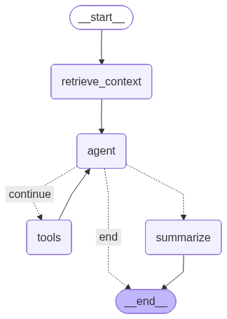

# Intelligent Chat Agent with Long-Term Memory



A production-ready intelligent chat agent API built with LangGraph and FastAPI that features:
- **Long-term memory** using ChromaDB vector store
- **Google Sheets integration** for real-time course data, links, FAQs, and company information
- **Chat summarization** for efficient context management
- **Conversation persistence** - all conversations are saved and can be retrieved
- **Production-ready** with Docker support, logging, and error handling

## Features

### 🧠 Long-Term Memory
- Stores all conversations in a vector database (ChromaDB)
- Semantic search to retrieve relevant context from past conversations
- Automatic conversation summarization to maintain context efficiency

### 🔍 Google Sheets Integration
- Real-time data fetching from Google Sheets (Course_Details, Course_Links, FAQs, About_Profr, Company_Info)
- Automatic tool calling when information retrieval is needed
- Webhook-based updates for instant data synchronization

### 💬 Intelligent Chat
- Context-aware responses using relevant past conversations
- Automatic summarization every N turns (configurable)
- Conversation history tracking and retrieval

## Installation

1. **Install dependencies:**
   ```bash
   uv sync
   ```

2. **Set up environment variables:**
   ```bash
   cp .env.example .env
   # Edit .env and add your OpenAI API key (required)
   # Configure Google Sheets credentials and other settings
   ```

3. **Run the API server:**
   ```bash
   uv run python scripts/run_api.py
   ```
   
   The API will be available at `http://localhost:8009`
   - API Documentation: `http://localhost:8009/docs` (disabled in production)
   - Health Check: `http://localhost:8009/health`

## Configuration

Edit `.env` file to configure:

- `OPENAI_API_KEY`: Your OpenAI API key (required for GPT models)
- `API_KEY`: Static API key for securing endpoints (optional, but recommended for production)
  - If not set, all endpoints are accessible (development mode)
  - If set, protected endpoints require `X-API-Key` header
- `MODEL_NAME`: Model to use (default: `gpt-4o`)
- `TEMPERATURE`: LLM temperature (default: `0.7`)
- `MEMORY_DB_PATH`: Path to store the memory database (default: `./memory_db`)
- `SUMMARIZE_INTERVAL`: Number of turns before summarizing (default: `10`)
- `API_HOST`: API server host (default: `0.0.0.0`)
- `API_PORT`: API server port (default: `8009`)
- `API_RELOAD`: Enable auto-reload for development (default: `false`)


## Usage

### API Mode

Start the FastAPI server:
```bash
uv run python scripts/run_api.py
```

The API will be available at `http://localhost:8009` with interactive documentation at `/docs`.

#### API Endpoints

**POST `/chat`** - Send a message to the agent (Protected - requires API key)
```bash
curl -X POST "http://localhost:8009/chat" \
  -H "Content-Type: application/json" \
  -H "X-API-Key: your-api-key-here" \
  -d '{
    "message": "Hello! My name is Alice.",
    "conversation_id": null
  }'
```

**Note:** If `API_KEY` is set in environment, you must include the `X-API-Key` header.

Response:
```json
{
  "response": "Hello Alice! Nice to meet you...",
  "conversation_id": "uuid-here",
  "turn_count": 1,
  "context_used": [],
  "timestamp": "2024-01-01T12:00:00"
}
```

**GET `/conversations/{conversation_id}`** - Get conversation history (Protected)
```bash
curl "http://localhost:8009/conversations/{conversation_id}" \
  -H "X-API-Key: your-api-key-here"
```

**GET `/conversations`** - List all conversations (Protected)
```bash
curl "http://localhost:8009/conversations?limit=10" \
  -H "X-API-Key: your-api-key-here"
```

**GET `/conversations/{conversation_id}/summary`** - Get conversation summary (Protected)
```bash
curl "http://localhost:8009/conversations/{conversation_id}/summary" \
  -H "X-API-Key: your-api-key-here"
```

**POST `/conversations/{conversation_id}/search`** - Search conversation context (Protected)
```bash
curl -X POST "http://localhost:8009/conversations/{conversation_id}/search?query=python&k=5" \
  -H "X-API-Key: your-api-key-here"
```

**GET `/health`** - Health check (Public - no API key required)
```bash
curl "http://localhost:8009/health"
```

**GET `/`** - Root endpoint (Public - no API key required)
```bash
curl "http://localhost:8009/"
```

#### Python Client Example

```python
import requests
import os

# API key (set in environment or use directly)
API_KEY = os.getenv("API_KEY", "your-api-key-here")

# Headers with API key
headers = {
    "Content-Type": "application/json",
    "X-API-Key": API_KEY
}

# Send a message
response = requests.post(
    "http://localhost:8009/chat",
    headers=headers,
    json={
        "message": "Hello! My name is Alice.",
        "conversation_id": None
    }
)
data = response.json()
print(f"Response: {data['response']}")
print(f"Conversation ID: {data['conversation_id']}")

# Continue conversation
response = requests.post(
    "http://localhost:8009/chat",
    headers=headers,
    json={
        "message": "What's my name?",
        "conversation_id": data['conversation_id']
    }
)
print(f"Response: {response.json()['response']}")
```

### Example Session

```
You: I'm planning a trip to Japan next month
Assistant: That sounds exciting! Japan is a beautiful country...

[After several turns...]

You: What was I planning earlier?
Assistant: You mentioned planning a trip to Japan next month...
[Used 3 relevant context(s) from memory]
```

## Production Deployment

### Docker Production (Using Pre-built Image)

**Quick Start:**
```bash
# 1. Copy production compose file
cp docker-compose.prod.yml.example docker-compose.prod.yml

# 2. Configure environment
cp .env.example .env
nano .env  # Add your API keys

# 3. Deploy
docker-compose -f docker-compose.prod.yml up -d

# 4. Check status
docker-compose -f docker-compose.prod.yml ps
docker-compose -f docker-compose.prod.yml logs -f
```

**Using Specific Version:**
Edit `docker-compose.prod.yml` and change:
```yaml
image: kamilzafar/ict_agent:v1.0.0  # Instead of :latest
```

See `docs/DOCKER_PRODUCTION.md` for detailed production deployment guide.

### CI/CD Pipeline (GitHub Actions)

The repository includes an automated CI/CD pipeline that:
1. **Builds** Docker image on every push to `main`/`master`
2. **Pushes** image to Docker Hub (`kamilzafar/ict_agent:latest`)
3. **Deploys** automatically to Hostinger VPS using Hostinger's official action

**Setup:**
1. Configure GitHub Secrets and Variables:
   - **Secrets** (Settings → Secrets and variables → Actions → Secrets):
     - `HOSTINGER_API_KEY`: Your Hostinger API key (from hPanel → API settings)
     - `DOCKERHUB_USERNAME`: Your Docker Hub username
     - `DOCKERHUB_TOKEN`: Docker Hub access token
   - **Variables** (Settings → Secrets and variables → Actions → Variables):
     - `HOSTINGER_VM_ID`: Your VPS Virtual Machine ID (e.g., `123456` from `srv123456.hstgr.cloud`)

2. Configure environment variables on your Hostinger VPS:
   - Via hPanel → Docker Manager → Environment Variables
   - Or via SSH terminal → edit `.env` file or `docker-compose.prod.yml`

3. Ensure `docker-compose.prod.yml` exists in your repository root

4. Push to `main` branch to trigger automatic deployment

**Benefits:**
- ✅ No SSH keys needed - Uses Hostinger API
- ✅ Simpler setup - Just API key and VM ID
- ✅ Automatic deployment management

See `.github/workflows/HOSTINGER_SETUP.md` for detailed setup instructions.

### Nginx Proxy Setup

The application is configured to work behind an nginx reverse proxy. See `docs/NGINX_SETUP.md` for detailed nginx configuration.

**Quick setup:**
```bash
# Copy nginx configuration
sudo cp nginx/nginx.conf.example /etc/nginx/sites-available/ict-agent

# Edit and enable
sudo nano /etc/nginx/sites-available/ict-agent
sudo ln -s /etc/nginx/sites-available/ict-agent /etc/nginx/sites-enabled/
sudo nginx -t
sudo systemctl reload nginx
```

## Architecture

### LangGraph Workflow

The agent uses a LangGraph state graph with the following workflow (see diagram above):

1. **retrieve_context**: Searches long-term memory for relevant context from past conversations
2. **agent**: Calls the LLM with available tools (Google Sheets tools, MCP RAG tools)
3. **tools**: Executes tools if needed (loops back to agent after execution)
4. **summarize**: Creates conversation summaries periodically (every N turns)
5. **end**: Completes the conversation

### Components

- **`app.py`**: FastAPI application with REST API endpoints
- **`core/agent.py`**: Main LangGraph agent with state management
- **`core/memory.py`**: Long-term memory system using ChromaDB
- **`core/sheets_cache.py`**: Google Sheets caching and semantic search service
- **`tools/sheets_tools.py`**: Google Sheets data fetching tools
- **`tools/mcp_rag_tools.py`**: MCP RAG sheets tool for lead capture
- **`config/prompt.txt`**: System prompt for the agent

### Memory System

- Uses ChromaDB for vector storage
- Embeds conversation summaries using OpenAI embeddings (`text-embedding-3-small` with 512 dimensions)
- Stores conversation metadata in JSON
- Supports semantic search for context retrieval
- Thread-safe operations for concurrent access

### Project Structure

```
ict_agent/
├── app.py                  # FastAPI application (root)
├── docker-compose.yml      # Docker Compose configuration
├── core/                   # Core agent and memory components
│   ├── agent.py           # LangGraph agent implementation
│   ├── memory.py          # Long-term memory system
│   └── sheets_cache.py    # Google Sheets caching service
├── tools/                  # LangChain tool integrations
│   ├── sheets_tools.py    # Google Sheets data fetching tools
│   └── mcp_rag_tools.py   # MCP RAG sheets tool for lead capture
├── docker/                 # Docker configuration
│   └── Dockerfile
├── config/                 # Configuration files
│   └── prompt.txt         # System prompt
├── scripts/                # Utility scripts
│   └── run_api.py         # API server runner
├── pyproject.toml         # Dependencies
└── README.md              # This file
```

### Adding Custom Tools

To add custom tools, create new tool modules in `tools/` and integrate them in `core/agent.py`.

## License

MIT License

